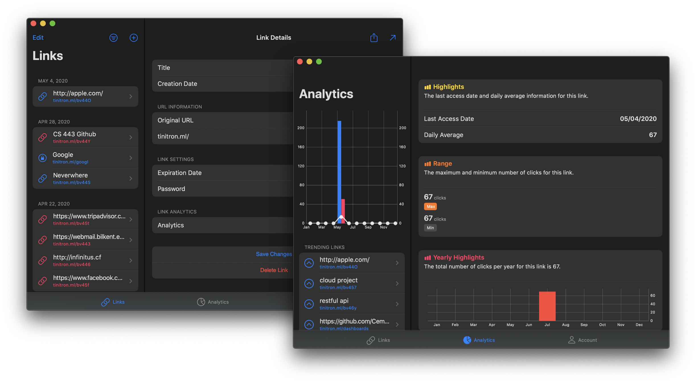

<p align="center">
   
</p>

# Tinitron (Client application for Tinitron) 
(Built for the CS 443 Course Project Group #9)



Shorten, create and share trusted, powerful links for your business. Tinitron helps you maximize the impact of every digital initiative.

## Get it

[](https://apps.apple.com/us/app/tinitron/id1509489379)

## Features
**Shorten**
Scrap long links! Shorten and brand your links to increase clicks while maintaining the tracking parameters you desire.

**Measure**
Share your links and let us help with the rest. See channel data, uncover dark social metrics, and learn when and where your audience is most engaged - all in one simple dashboard.

**Optimize**
Connect your social networks for easy sharing through Tinitron across social, SMS, display, social, and other channels. Collect insights on your performance and optimize your efforts to fit your audience's needs.

## Website
[Tinitron](https://tinitron.cf)

##  Architecture


## API Documentation
[Postman API Documentation](https://documenter.getpostman.com/view/8064086/Szmb5z6H)

## Build
Create a new Firebase + Google Cloud Project if you haven't done so already.
```
$ export PROJECT_ID=...
$ gcloud project create $PROJECT_ID
```
Download 'GoogleService-Info.plist' and replace with the existing file.

Open a new terminal direct to project folder.
```
$ pod install
$ pod update
```

Open Tinitron.xcworkspace set developement account.
Build project then run.

## License
Tinitron for iOS & macOS is licensed under the GNU Public License, version 2.0. See [LICENSE](LICENSE) for more information.
